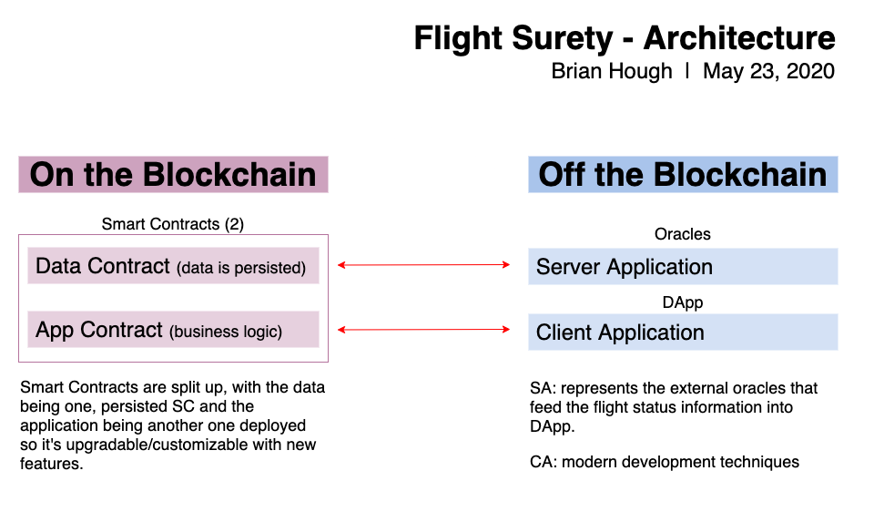
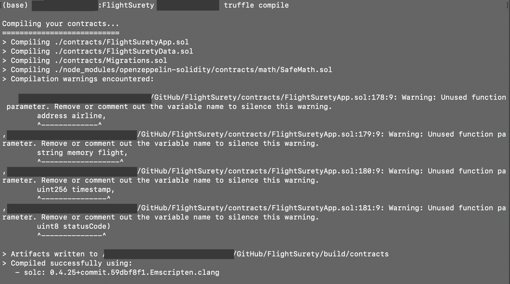
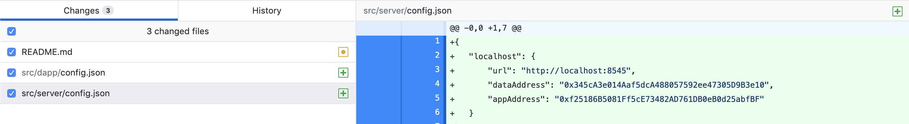
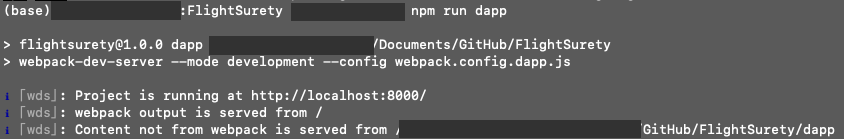
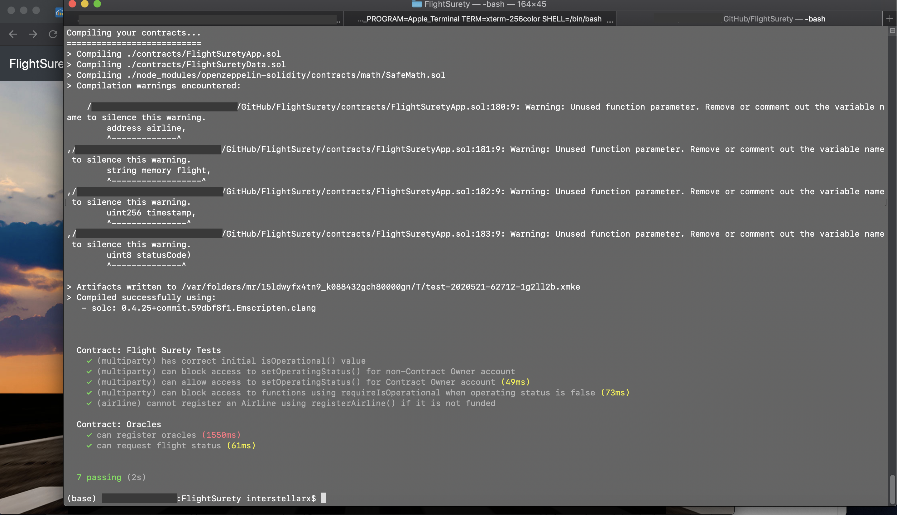

# FlightSurety: an Oracle and Smart Contract-Powered Decentralized Application

## **Definition:** 
FlightSurety is a decentralized application on flight delay insurance for passengers. It's managed as a collaboration between multiple airlines, giving passenters the ability to purcahse insurance prior to a flight. If the flight is delayeddue to the fault of the airline, then the passengers are paid 1.5X the amount they paid for the insurance. Finally, oracles will be used as a mechanism for providing flight status information into the contract.

To note, in a real-world example, the amount that would be paid back to the passengers would most likely be computed with advanced algorithms and methods. The 1.5X figure was an arbitrary one used for examplary purposes and for sake of simplicity.

## Programming Libraries Used:
- **Truffle v5.1.14-nodeLTS.0 (core: 5.1.13):** used in project to deploy, test, and deploy DApp's smart contracts.
- **Solidity v0.5.16 (solc-js):** an object-oriented, high-level langauge for writing, designing, and implementing smart contracts.
- **OpenZeppelin v2.1.2:** minimizes risk by using battle-tested libraries of smart contracts.
- **Node v12.16.2:** used for easily building fast and scalable network applications - integral for deploying UI to the browswer.
- **Web3.js v1.2.1:** used to allow the DApp to interact with a local/remote Ethereum node with an HTTP, HTTPS, or IPC connection.

 

## Install

This repository contains Smart Contract code in Solidity (using Truffle), tests (also using Truffle), dApp scaffolding (using HTML, CSS and JS) and server app scaffolding.

To install, download or clone the repo, then:

`npm install`
`truffle compile`

## Develop Client

To run truffle tests:

`truffle test ./test/flightSurety.js`
`truffle test ./test/oracles.js`

To use the dapp:

`truffle migrate`
`npm run dapp`

To view dapp:

`http://localhost:8000`

## Develop Server

`npm run server`
`truffle test ./test/oracles.js`

## Deploy

To build dapp for prod:
`npm run dapp:prod`

Deploy the contents of the ./dapp folder

## Resources

* [How does Ethereum work anyway?](https://medium.com/@preethikasireddy/how-does-ethereum-work-anyway-22d1df506369)
* [BIP39 Mnemonic Generator](https://iancoleman.io/bip39/)
* [Truffle Framework](http://truffleframework.com/)
* [Ganache Local Blockchain](http://truffleframework.com/ganache/)
* [Remix Solidity IDE](https://remix.ethereum.org/)
* [Solidity Language Reference](http://solidity.readthedocs.io/en/v0.4.24/)
* [Ethereum Blockchain Explorer](https://etherscan.io/)
* [Web3Js Reference](https://github.com/ethereum/wiki/wiki/JavaScript-API)
* [Ethereumdev.io: Using Safe Math library to prevent from overflows](https://ethereumdev.io/using-safe-math-library-to-prevent-from-overflows/) - learning about SafeMath
* [OpenZeppelin-contracts GitHub issue on SafeMath not providing detection of losing precision by division](https://github.com/OpenZeppelin/openzeppelin-contracts/issues/1759)
* [Coursetro: Solidity Mappings & Structs Tutorial](https://coursetro.com/posts/code/102/Solidity-Mappings-&-Structs-Tutorial#)

___

# Architecture Overview:

This DApp has five components: 
1. **Business applicaton:** the overall delay insurance concept 
2. **Multi-party:** the collaboration between multiple airlines
3. **Payable keyword:** creating transactions where users can pay using the payable keyword
4. **Payout capability:** if the flight is delayed and the passenger has to be paid, it's unwise to send money to passengers, but you'll credit their account and have them withdraw the funds.
5. **Oracles:** used to get the flight information

### A map of the on and off-chain DApp architecture can be be [found](./images/Flight-Surety-Architecture.png) here on in the following image:

# Project Requirements:

There are five main requirements for the project:
- **Separation of Concerns:**
    - FlightSuretyData contract for data persistence
    - FlightSuretyApp contract for app logic and oracles code
    - DApp client for triggering contract calls (might occur based on user input, for example, a passenger decides to buy insurance for a flight, which would trigger all of the different contract calls)
    - Server app for simulating the behaviors and responses of the oracles
- **Airlines:**
    - Register the first airline when contract is deployed
    - Only existing airline may register a new airline until there are at least four airlines registered
    - Registration of fifth and subsequent airlines requires multi-party consensus of 50% of registered airlines to approve following airlines. 
        - As you create an entity, as more members are welcomed to it, it causes dillution of existing members, they might want to have a say about who's apart of the system.
    - Registration of an airline within smart contract must be two-level:
        1. When they're registered and approved after the multi-party consensus has occured or not approved if the multi-party consensus fails 
        2. All airlines provide some funding within the app (seed funding for the insurance) - requirement for every airline, and each airline must submit 10 Ether
- **Passengers:**
    - Passengers may pay up to 1 Ether for purchasing flight insurance (this is the cap for investing)
    - Flight numbers and timestamps are fixed for the purpose of the project and can be defined in the DApp client (could integrate APIs but those are usually premium services or their free trials are often limited to 7 days)
        - For the purpose of this project, the application has been given arbitrary flight numbers and timestamps and have users select those for insurance.
    - If flight is delayed due to airline fault, passenger receives credit of 1.5X the amount they paid
    - When funds are transfered (when plan delayed), the funds are transfered from contract to the passenger wallet only when they initiate a withdrawl.
        - Reasoning: the debit-before-credit concept
- **Oracles:**
    - Oracles are implemented as a server application (with Node.js)
        - Recommended to use 10, 15 or 20 oracles
        - What could it look like with 100+ oracles?
    - Upon startup, 20+ oracles are registered and their assigned indexes are persisted in memory
        - Having a large number of oracles ensures that we don't have to put a large amount of trust in any single oracle.
    - Client DApp is used to trigger request to update flight status, generating OracleRequest event that is captured by the server
        - Generally, you'd want to create a cluster of oracles that in the simulation resolve the same status code and some that don't. This exercises smart contract code which are checking which oracles provide different information.
        - Oracles know b/c of a button that originates in the UI. Normally, it would originate by a third-party API notifying you or your server app that the flight has landed or has taken off.
    - Because this doesn't use an API, this project's life cycle is as follows for oracle involvement:
        1. A button in the client DApp triggers an event when clicked on.
        2. That event communicates with the smart contract and causes a request to be generated for the oracles.
        3. The oracles then fetch the data for a specific flight.

- **General:**
    - Contracts must have operational status control.
        - Every critical state-changing function within smart contracts must have an ability for them to be paused.
        - Duel-purpose manner (for efficiency): The airlines already have multi-party control, so make it shareable for voting whether a new airline can be registered and voting on whether the application can be paused.
    - Functions must fail fast - use require() at the start of functions.
        - so there is little or no gas expended by the user and costs can be kept low.

# Overview of [Smart Contracts](./contracts)
There are two smart contracts used in FlightSurety for the App and for the Data.

## **[FlightSuretyApp.sol](./contracts/FlightSuretyApp.sol)**
- this has the app/DApp logic and oracles code
- List of the 6 flight status codes:
    - `Unknown`
    - `On_Time`
    - `Late_Airline`: flight was delayed due to the airline but not other reasons
    - `Late_Weather`
    - `Late_Technical`
    - `Late_Other`
- List of 3 functions:
    - `registerFlight`: when user makes a choice in the UI, what options are available to them? Maybe just have list of flights available to them. Or provide ability to register a flight and retrive a list of flights when user is ready to make a selection. Flights all have timestamps, so can maybe only show flights for the future?
    - `processFlightStatus`: function that is supposed to be triggered when oracle comes back with a result and it decides what to do from there.
    - `fetchFlightStatus`: triggered from the UI (not automated by a third-party API), calls this function, generates the event, picked up by the oracles.

## **[FlightSuretyData.sol](./contracts/FlightSuretyData.sol)**
- this is the persistent file that has all the data
- List of the 6 core functions:
    - `registerAirline`
    - `buy`
    - `creditInsurees` 
    - `pay`
    - `fund`
    - `getFlightKey`

## **[SafeMath.sol contract](./node_modules/openzeppelin-solidity/contracts/math/SafeMath.sol)**
- Needed to update the `pragma solidity ^0.4.24;` file to `>=0.4.25`

# Requirements:

## Contracts compile successfully!

## Created server with npm run start

## Deployed

## Terminal code of transactions/hashes:
    net_version
    eth_blockNumber
    eth_getBlockByNumber
    eth_getTransactionCount
    eth_sendRawTransaction

    Transaction: 0xdefbc0fc691af6021ed87eddd0c4f3b4c84b911c525d95f97efd0d69f8b34b9d
    Contract created: 0x8cdaf0cd259887258bc13a92c0a6da92698644c0
    Gas usage: 238582
    Block Number: 1
    Block Time: Sat Jun 20 2020 09:13:37 GMT-0400 (Eastern Daylight Time)

    eth_getTransactionReceipt
    eth_getCode
    eth_getBlockByNumber
    eth_getBlockByNumber
    eth_sendRawTransaction

    Transaction: 0x0a487bf4bf72b9ad7207c31c28c49926314452ccd5ab0179de8353147437658d
    Gas usage: 42348
    Block Number: 2
    Block Time: Sat Jun 20 2020 09:13:37 GMT-0400 (Eastern Daylight Time)

    eth_getTransactionReceipt
    eth_getBlockByNumber
    eth_getBlockByNumber
    eth_getBlockByNumber
    eth_getBlockByNumber
    eth_getBlockByNumber
    net_version
    eth_getBlockByNumber
    eth_getBlockByNumber
    eth_getBlockByNumber
    eth_getBlockByNumber
    eth_getBlockByNumber
    eth_getBlockByNumber
    eth_getBlockByNumber
    eth_getBlockByNumber
    eth_getBlockByNumber
    eth_getBlockByNumber
    eth_getBlockByNumber
    eth_getBlockByNumber
    net_version
    eth_getBlockByNumber
    eth_estimateGas
    net_version
    eth_blockNumber
    eth_getBlockByNumber
    eth_sendRawTransaction

    Transaction: 0x9257889f8cfafa2531f78368022bc8855690c1f856910a6402e33b9a1eba1a93
    Contract created: 0x345ca3e014aaf5dca488057592ee47305d9b3e10
    Gas usage: 211462
    Block Number: 3
    Block Time: Sat Jun 20 2020 09:13:38 GMT-0400 (Eastern Daylight Time)

    eth_getTransactionReceipt
    eth_getCode
    net_version
    eth_getBlockByNumber
    eth_getBlockByNumber
    net_version
    eth_getBlockByNumber
    eth_estimateGas
    net_version
    eth_blockNumber
    eth_getBlockByNumber
    eth_sendRawTransaction

    Transaction: 0xa336a4e39aaab4a4e830f712de699fea418bcbed0cfafcc9ed8b76784a48d2ab
    Contract created: 0xf25186b5081ff5ce73482ad761db0eb0d25abfbf
    Gas usage: 1063936
    Block Number: 4
    Block Time: Sat Jun 20 2020 09:13:39 GMT-0400 (Eastern Daylight Time)

    eth_getTransactionReceipt
    eth_getCode
    eth_getBlockByNumber
    eth_getBlockByNumber
    eth_getBlockByNumber
    eth_getBlockByNumber
    eth_getBlockByNumber
    eth_getBlockByNumber
    eth_sendRawTransaction

    Transaction: 0xce556d511be06fa1e97b8609a9b527401cc7ba1e40fca85b0a9461d6a6715d67
    Gas usage: 27348
    Block Number: 5
    Block Time: Sat Jun 20 2020 09:13:39 GMT-0400 (Eastern Daylight Time)

    eth_getTransactionReceipt

## FlightSurety Deployed In Browswer

## FlightSurety Processes Correctly With `truffle migrate --reset`

    (base) XXXXXX:FlightSurety XXXXXX$ truffle migrate --reset

    Compiling your contracts...
    ===========================
    > Everything is up to date, there is nothing to compile.

    Starting migrations...
    ======================
    > Network name:    'development'
    > Network id:      1592658794416
    > Block gas limit: 0x6691b7

    1_initial_migration.js
    ======================

    Deploying 'Migrations'
    ----------------------
    > transaction hash:    0xcdbaf7e48655eb84f1330b6badc65edf464171e654cc9a9f67cf31fd2d946015
    > Blocks: 0            Seconds: 0
    > contract address:    0x3d49d1eF2adE060a33c6E6Aa213513A7EE9a6241
    > block number:        33
    > block timestamp:     1592671151
    > account:             0x627306090abaB3A6e1400e9345bC60c78a8BEf57
    > balance:             99.84189658
    > gas used:            238582
    > gas price:           20 gwei
    > value sent:          0 ETH
    > total cost:          0.00477164 ETH

    > Saving migration to chain.
    > Saving artifacts
    -------------------------------------
    > Total cost:          0.00477164 ETH

    2_deploy_contracts.js
    =====================

    Deploying 'FlightSuretyData'
    ----------------------------
    > transaction hash:    0x76b239e3d81f3980bd5d60dca5d7f0879453b96b1593a17c9046b5e67188c327
    > Blocks: 0            Seconds: 0
    > contract address:    0xBd2c938B9F6Bfc1A66368D08CB44dC3EB2aE27bE
    > block number:        35
    > block timestamp:     1592671153
    > account:             0x627306090abaB3A6e1400e9345bC60c78a8BEf57
    > balance:             99.83682038
    > gas used:            211462
    > gas price:           20 gwei
    > value sent:          0 ETH
    > total cost:          0.00422924 ETH

    Deploying 'FlightSuretyApp'
    ---------------------------
    > transaction hash:    0x346e8b5c155292a98258837b4d7302a38b3086bffcc713d61060dfe03985c085
    > Blocks: 0            Seconds: 0
    > contract address:    0x2EcA6FCFef74E2c8D03fBAf0ff6712314c9BD58B
    > block number:        36
    > block timestamp:     1592671153
    > account:             0x627306090abaB3A6e1400e9345bC60c78a8BEf57
    > balance:             99.81554166
    > gas used:            1063936
    > gas price:           20 gwei
    > value sent:          0 ETH
    > total cost:          0.02127872 ETH

    > Saving migration to chain.
    > Saving artifacts
    -------------------------------------
    > Total cost:          0.02550796 ETH

    Summary
    =======
    > Total deployments:   3
    > Final cost:          0.0302796 ETH

# All Seven Tests Pass Successfully!

